# Predicting the Daily Ridership of the One Train

*As a data scientist living in New York, the subway train I have taken the most has been the One Train. It is a part of the huge NYC subway system that runs locally on the west side of the city. I have taken the train so many times that I couldn't help but wonder about some stats and see if I could predict its daily ridership.*

## Ridership Statistics

#### Hourly average of all the subway stations: 
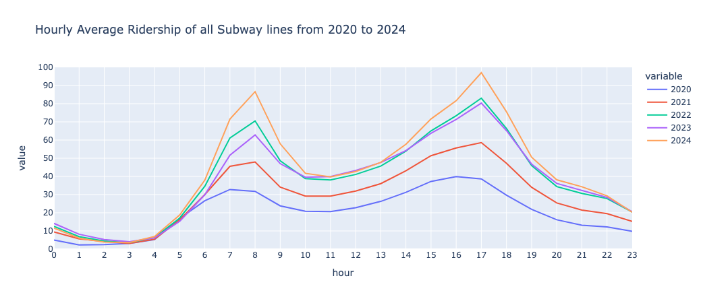

#### Daily average of all the subway stations:
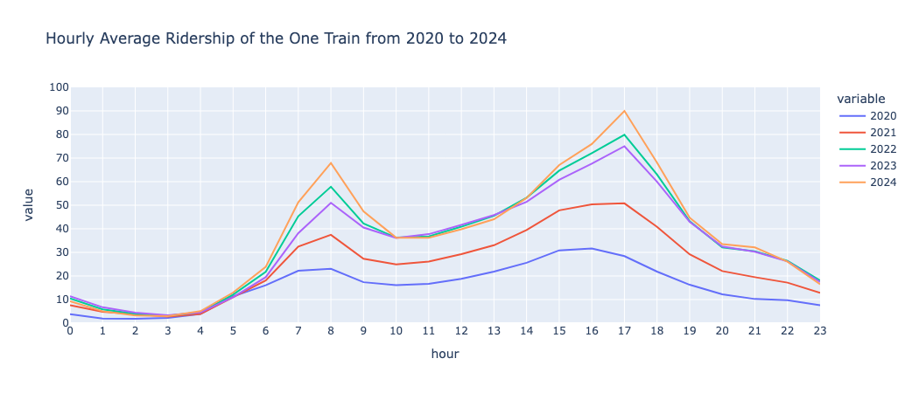

#### Top Ten Subway Stations of the One train by Volume of people: 
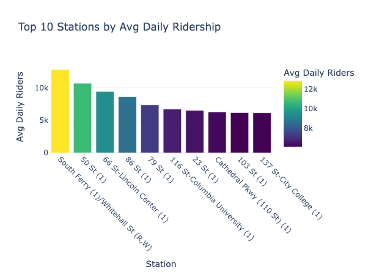

## Time Series Analysis
### The Messy Data: 
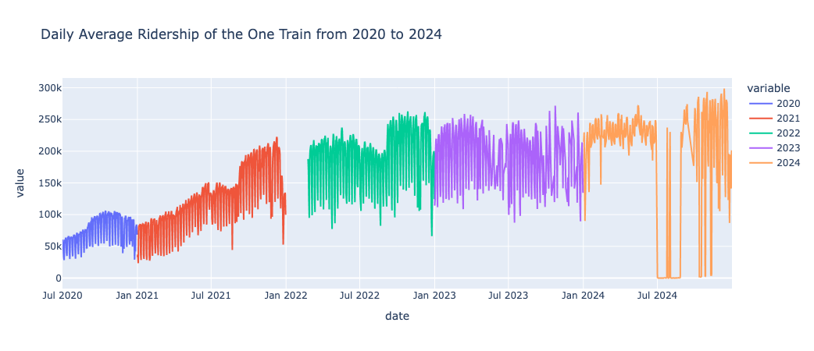

### Dealing with Missing Data Interpolating
#### Before Interpolation: 
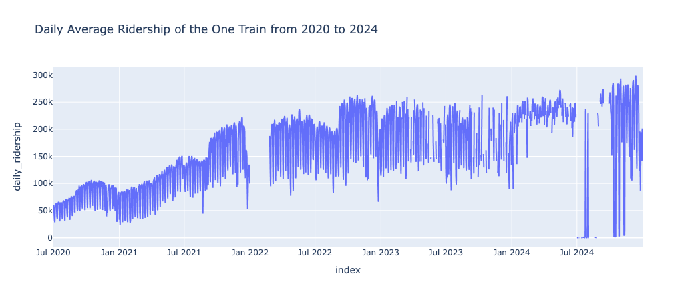

#### After Interpolation: 
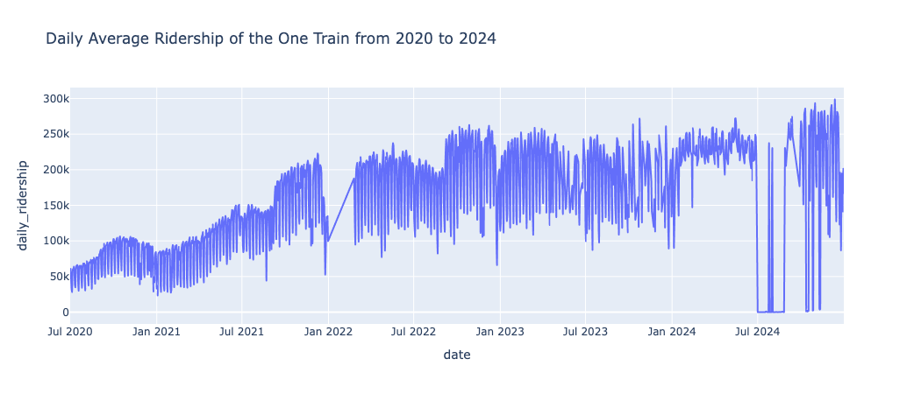

#### Final Training Data Set:
*Unfortunately, a lot of the open source data is missing, Also an important note of the methodology is that there is often a delay in when the transaction is made and when OMNI registers it, making daily prediction unfortunately unreliable.
To reduce the chances of errors, we take the data after feb 24, 2022*
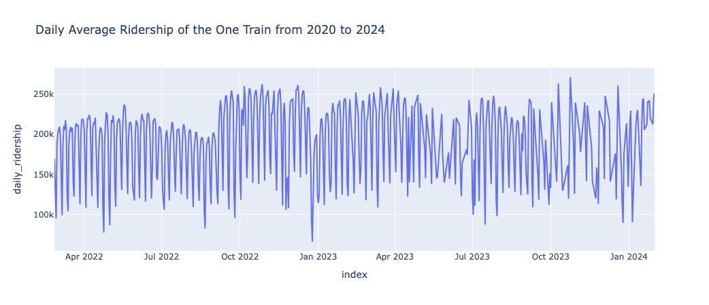

### Stationarity:

*A stationary time series has a constant mean and variance through time. Before using ARIMA we must check for a stationary time series.The time series we are using is clearly not stationary, the average number of people are increasing over time. The data also very clearly has seasonal trends, between weekdays and weekends. The variance is also not constant as over time the maximum and minimum are changing.*
How to make a time series stationary ?
1. Making the mean constant
2. Making the variance constant
*One way to make the variance stationary is by log transform: This assumes that the  data follows an exponential trend.*
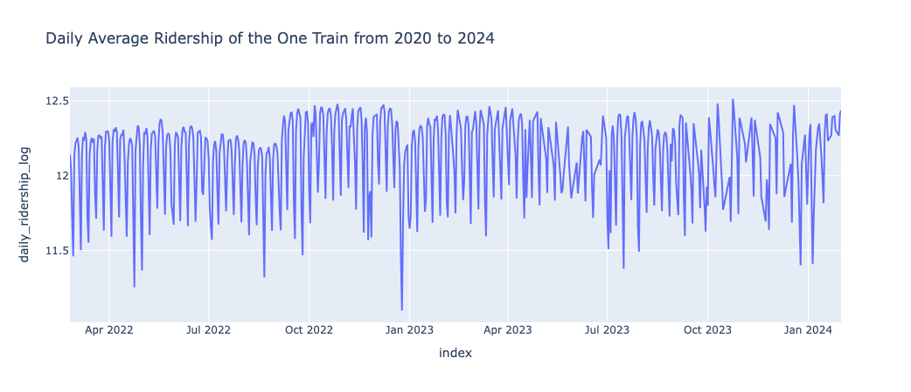

*The variance seems constant now but the mean is not : The most common way to make the mean constant is differencing, That is where the difference at the time t between the series at time y(t) and y(t-1)*
*Stabilize the variance before stabilizing the mean.*
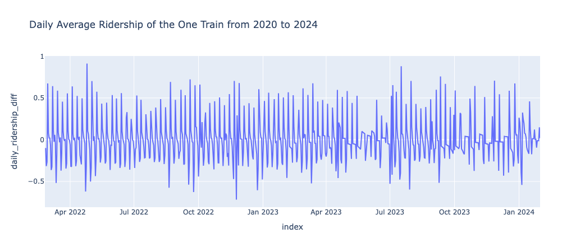

*Variance transformations like logarithmic or Box-Cox transformations are nonlinear and change both the variance and mean structures of the series. However, mean transformations (like differencing or de-trending) generally don't affect the variance pattern.*

#### Box-Cox Transform
*Another way to ensure stationarity for transform is thorough box-cox transform. The Box-Cox Transform changes Non Normal Distribution to Normal Distribution. Common models such as ARIMA assume that we are dealing with Box-Cox Transform. It is preferred over log transform, as it is more stable.*
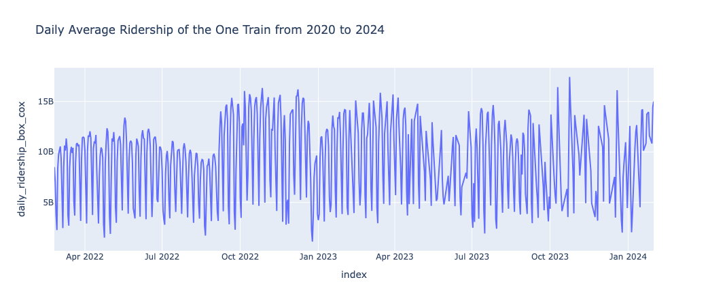

### Time Series Decomposition

*A Time Series is composed of three main elements : Trend, Seasonality and Residual/Remainder*
Additive Model :
Y = T + S + R
Multiplicative Model :
Y = T * S * R
We can also write it as :
ln(Y) = ln(T) + ln (S) + ln(R)

*In an additive model the function of time series is either decreasing or increasing by a constant. In a multiplicative model the function is increasing or decreasing by a variable* 
The Classical Approach:
1. Compute the trend component
2. De-trend the series Y - T and Y/T
3. Compute the seasonal component S
4. Compute the residual component R
#### Multiplicative Decomposition
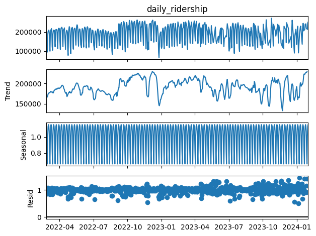

#### Additive Decomposition

### Autocorrelation

*Checking the correlation of time series data with the lagged version of the same data to figure out seasonality.*

### Partial Autocorrelation

*Partial autocorrelation is the correlation of time series at two different lags ignoring the intermediate lags. ACF is more useful as it helps in determining seasonality, trends( if it needs differencing). PACF can help us determine auto regressive components.*

## Forecasting Techniques
*In this section, I will be experimenting with Holt-Winters Model, ARIMA and SARIMA, to see which fits the best.*

### Holt-Winters Model
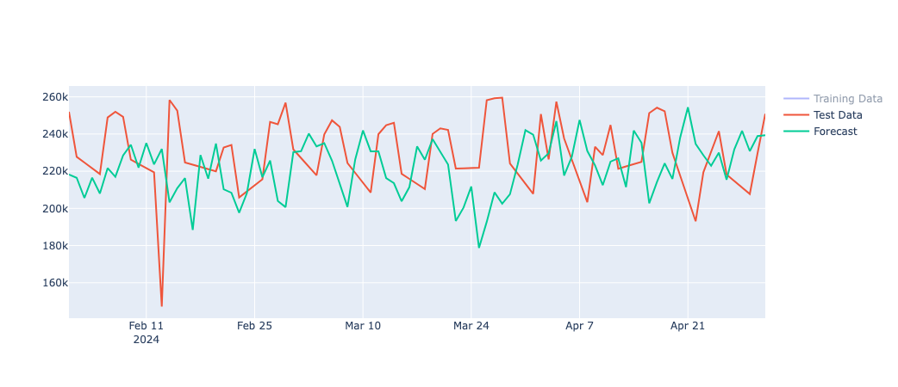

#### Residual Analysis
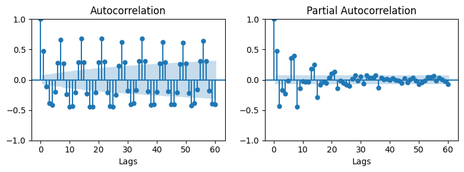

### ARIMA
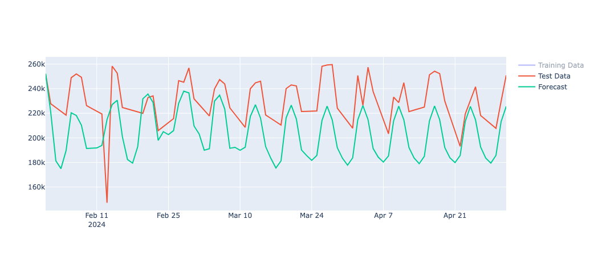

#### Residual Analysis
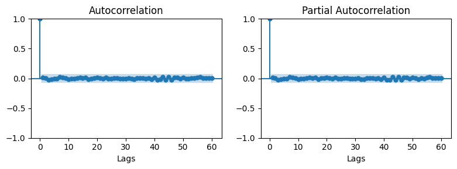

### SARIMA
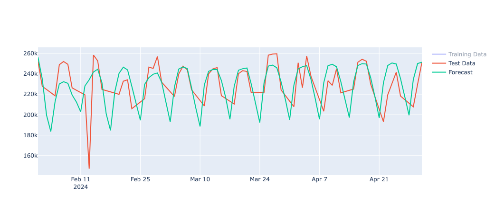

#### Residual Analysis

*For this data SARIMA seems to be working best. A few other methods that I did not try but would recommend for time series analysis are : TBATS, LSTMS and Fourier Series and Harmonic Regression.*
